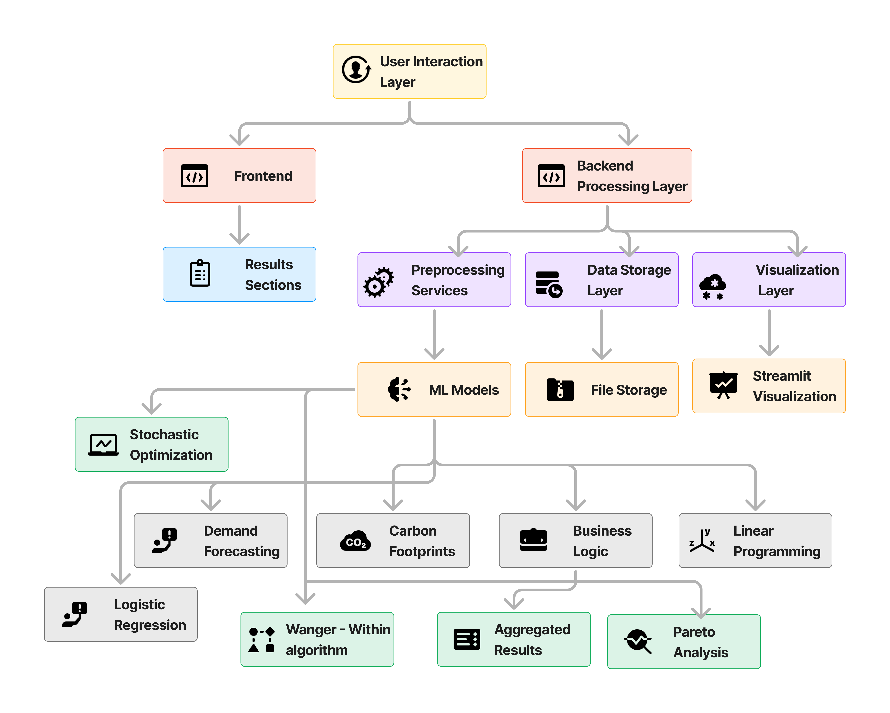

# Saartha
An AI prototype that optimizes the ENTIRE OEM supply chain while tackling the global supply chain problems.

It contains 3 main features:
1. Supply Chain Optimization
2. Control Carbon Emission
3. Intelligent Resource Management

## 1. Supply Chain Optimization
It uses the user input file to develop demand, material balance and resource utilization reports depending upon the selected category of analysis and various filters.

## 2. Control Carbon Emission
It contains 3 sections with the following functionality:

* Calculate and reduce your carbon footprint for your daily commute using simple machine learning algorithms.
* Calculate and Log your environmental impact while shipping and commuting using Machine learning algorithms: Logistic Regression.
* Illuminating global carbon footprints through interactive data visualizations.

## 3. Intelligent Resource Management

It includes 5 sections aiming to evolve the resource planning in supply chain:
* Best Delivery Conditions: Cost and Emission - predicts the best delivery conditions based on cost and mission for a given shipment.
* Warehouse Layout Optimization - uses Pareto Analysis to optimize warehouse layout.
* Production Planning - reduces total cost by leveraging holding and setup cost to plan production.
* Weekly Worker-Demand Planning - optimizes the weekly staff supply-demand planning while establishing employee retention.
* Inventory Planning - provides graph depecting planning of inventory over time according to sales.

### Architecture of Saartha
Saartha utilises various ml models such as logistic regression etc while developing models with own functionality


### Video Demo of Saartha
[Watch this video on YouTube](https://youtu.be/l9zM0OGfnSc)


## Installation
Clone the repository
```
git clone https://github.com/sharmaanchita/SAARTHA.git
```
Create python venv
```
python3 -m venv venv
```
Activate venv
```
source venv/bin/activate
```
Install dependencies
```
pip install -r requirements.txt
```
Run the app
```
streamlit run home.py
```


